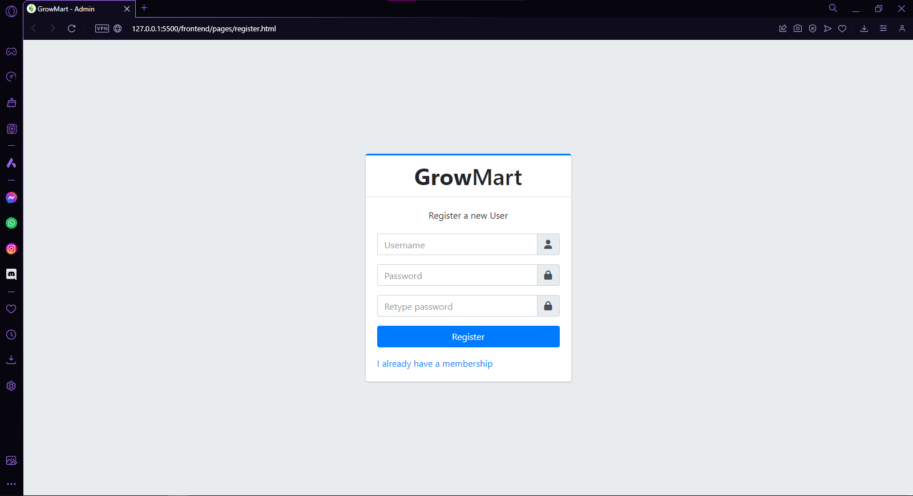

# Proyect GrowMart

This application is a project developed using Java Spring Boot which allows users to register and then access an interactive page to visualize information about the gardening company, the information is fetched from the backend.

With this project, all the concepts of Java and Spring Boot seen in class are consolidated, creating a complete application that integrates all this knowledge.

## Characteristics

- User registration: Allows users to register in the application by providing a username and password.
- Login: Users can log in to the application using the credentials provided during registration.
- Interactive dashboard: After logging in, users have access to an interactive dashboard where they can view dynamic information provided from the backend.

## Prerequisites

- JDK (Java Development Kit) installed on your system.
- Maven installed on your system.
- IntelliJ or another IDE installed on your system.

## Technologies used in the project

1. Back-End 
- Java
- Spring Boot 
  + JPA
  + JPQL
  +  Spring Security
  +  JWT
- MySQL
- Swagger

2. Front-End
- Javascript
- Css
- Bootstrap
- HTML
- AdminLTE


## Project construction


### folder structure

The folder structure was defined, separating the backend and the front end into two large blocks

<div align="center">
  <h3>Folder structure</h3>
  
</div>

The following sections will define how these folders are composed and their functionality.

### Application Design  

The design of the application was made using figma

To see the design just click [here](https://www.figma.com/file/10oCpHTkY67wEWVlG6CyBb/Dise%C3%B1o-GrowMart?type=design&node-id=0%3A1&mode=design&t=5m6KtVSaB4bF12r5-1), you will be taken to the figma page where you will find the design.


### System Architecture

The system architecture was defined as follows

<div align="center">
  <h3>System Architecture</h3>
  
</div>

### Back-End  construction

#### Spring Boot entities

**Entities**

The data access api was built using spring boot and its JPA functionality to map entities into database tables.

<div align="center">
  <h3>Entities</h3>
  
</div>


These entities are used to store information and we use the annotations to define the mapping to the database.

<div align="center">
  <h3>Entity example</h3>
  
</div>


Each entity has its DTO, which is useful to transfer information between the layers of our application.

<div align="center">
  <h3>DAO</h3>
  
</div>


<div align="center">
  <h3>DAO Example</h3>
  
</div>


**Repositories**


For each entity its repository class is defined, where all the queries are defined.

<div align="center">
  <h3>Repository</h3>
  
</div>

<div align="center">
  <h3>Repository example</h3>
  
</div>


**Services**

Each entity defines its services to manage the information to be sent to those who request it.

<div align="center">
  <h3>Service</h3>
  
</div>

<div align="center">
  <h3>Service Example</h3>
  
</div>


**Controllers**

For each entity, its controllers are defined to manage the endpoint so that the information can be queried.


<div align="center">
  <h3>Controller</h3>
  
</div>

<div align="center">
  <h3>Controller Example</h3>
  
</div>


#### DataBase

The database management system chosen for the project was mySQL, which is very flexible and fast. 

Therefore the entity classes become mysql tables.

<div align="center">
  <h3>Tables</h3>
  
</div>

The entity-relationship model that we obtain from these entities is presented as follows 


<div align="center">
  <h3>Entity-Relationship Model</h3>
  
</div>


#### Authentication and Security


Spring Security was used to handle authentication, authorization and sessions. Spring Security is also used to handle common security issues such as Cross-Site Scripting and Cross-Site Request Forgery .

We have defined the config classes for OpenApi, web Security and Cors to define the initial configuration so that the project works properly. 

<div align="center">
   <h3>Config folder</h3>
  
</div>


While in our security folder, you have the configuration for JWT from the backend  

<div align="center">
  <h3>Security Folder</h3>
  
</div>


<div align="center">
  <h3>JWT Auth Config</h3>
  
</div>


There is the AuthController class to handle user authorization and authentication.


<div align="center">
   <h3>AuthController</h3>
  
</div>


#### Front-End construction

To access the information returned by the API, a page was created with html and css.

It was decided to use web page templates, taken from the *AdminLTE* framework, so the css of the html files is handled by the *Bootstrap* framework.

We have the pages for the user to log in, register, and the dashboard page with all the available queries.

- Home
- Log-In
- Register


<div align="center">
  <h3>Pages File</h3>
  
</div>


**Functionality**

The functionality and interactivity is handled by javascript.
The front-end functionality is organized in different javascript files.

In the API folder, we have defined the *config* file and the *queries* file.

<div align="center">
  <h3>Api Folder</h3>
  
</div>


With config we define the uri to do the queries

<div align="center">
  <h3>Config File</h3>
  
</div>


With queries  a special function is defined , which allows you to make all queries and fetch your information.


<div align="center">
  <h3>queries file</h3>
  
</div>


In the js folder, javascript files are defined for each html page. 

<div align="center">
  <h3>Js Folder</h3>
  
</div>


<div align="center">
  <h3>Log In js</h3>
  
</div>

The javascript app file is used to detect which page the user is on, and depending on this, it loads the corresponding javascript file.

<div align="center">
  <h3>App file</h3>
  
</div>


In the components folder, the html components  are defined with javascript, so that they can be used as html tags in other html files.

<div align="center">
  <h3>Components Folder</h3>
  
</div>


<div align="center">
  <h3>Component Example</h3>
  
</div>


In the util folder there are the files *Auth*, *Constants*, *Route*.

<div align="center">
  <h3>Util Folder</h3>
  
</div>

The Auth file handles everything related to authentication from the front end, defining that the user must register before logging in, verifying the user and token when user logs in, etc..

<div align="center">
  <h3>Auth File</h3>
  
</div>

In constants the uri from which the front-end works is defined

<div align="center">
  <h3>Constants File</h3>
  
</div>


In Routes file, the queries are saved in an object, so that they can be easily used from the file that displays the dashboard.

<div align="center">
  <h3>Routes File</h3>
  
</div>


## Installation and Execution

1. Clone this repository to your local machine.

```bash
git clone https://github.com/Dabrox02/GrowMart.git
```
2. Access the 'main' branch

```bash
git switch main
```

3. Configure the Application properties according to your mySQL or database management system username and password. Application properties is a general settings file for spring boot

<div align="center">
  <h3>Application properties Mysql</h3>
  
</div>

- *spring.datasource.url=jdbc:mysql://localhost:3306/jardineria* you change *jardineria* to the name of the database you defined
- *spring.datasource.username* you change the password 
- *spring.datasource.password* you change the user 

If you are using another database management system, you must find the corresponding dependency and add it to the pom file, and change the application properties settings to match your new database management system.

<div align="center">
  <h3>Mysql dependency</h3>
  
</div>


4. You can use the api documentation that is provided by swagger. With this documentation you can test the queries if you want to 


<div align="center">
   <h3>Swagger settings in application properties</h3>
  
</div>


You just have to enter the following link in your web browser

```bash
http://localhost:8080/doc/swagger-ui/index.html
```

<div align="center">
  <h3>Swagger view</h3>
  
</div>


5. Start the application, execute 'Run Application'.

<div align="center">
  <h3>Run Application</h3> 
  
</div>

4. Access the application from your web browser using the URL:
```bash
http://localhost:5500
```


## Usage


### User Registration

When you first enter the application you will be shown the page to create a user.

<div align="center">
  <h3>Sign up/Registration</h3> 
  
</div>

You have to enter a new user and define a password.

### Log in 

Once you enter the application, you can log in with the username and password you defined earlier.

<div align="center">
  <h3>Log In</h3> 
  
</div>

### Error logging in 

If you enter your credentials incorrectly, you will get an error message when trying to log in.

<div align="center">
  <h3>Error logging In </h3> 
  
</div>

### DashBoard and queries 

When you enter the dashboard, you have several options in the left panel, which are the entities that you can consult

<div align="center">
  <h3>DashBoard and queries</h3> 
  
</div>

You must click,  first to select one of the entities and then click again to make your query.

<div align="center">
  <h3>Select query</h3>
  
</div>

If you do so, the information you requested will be displayed, if you wish to make another query, just click and the page will be updated with the new query.

<div align="center">
  <h3>Select another query</h3>
  
</div>

## Contribution

Contributions are welcome. If you wish to contribute to this project, please follow the steps:

1. Make a fork of the project on github, and clone the repository on your pc.

2. Create a new branch .

```bash
git checkout -b feature
```

3. Commit the changes you added

```bash
git commit -am 'Add new feature'
```

4. Push the branch you created

```bash
git push origin feature
```

5. Create a new Pull Request in your github fork repository.